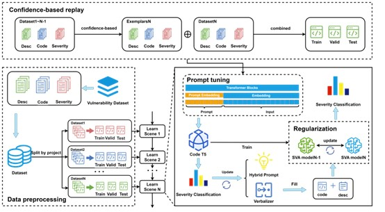

# Prompt Tuning-based Software Vulnerability Assessment with Continual Learning

This is the source code to the paper "Prompt Tuning-based Software Vulnerability Assessment with Continual Learning". Please refer to the paper for the experimental details.

## Approach

## Datasets
The original dataset is MegaVul, you can download it from the <a href="https://github.com/Icyrockton/MegaVul">link</a>.

And the processed dataset you can download from <a href="https://drive.google.com/drive/folders/1GuchdeFsGUKh8tvCles9kcjIcC-loD5v?usp=drive_link">Google Drive</a>.

## Requriements
You can install the required dependency packages for our environment by using the following command: pip install - r requirements.txt.

## Data preprocess
Simulate our dataset into a continuous stream. Like we split our original dataset into five tasks.

## Reproducing the experiments
1.Run SVACL/confidence-basedReplayEWC.py. After running, you can retrain the model and obtain results.

2.You can find the implementation code for the RQ1-RQ5 section experiments in the corresponding folders. The results obtained from the experiment are also in the corresponding folder.

#### RQ1: How does our proposed method SVACL perform compared to the state-of-the-art SVA baselines?
Under the folder of RQ1, you can implement the experiments of the baselines we used in this paper.

#### RQ2: Can considering two types of vulnerability information improve the performance of SVACL?
Under the folder of RQ2, you can implement the ablation study between using different types of vulnerability information

code.py: The experiment only uses source code as input

desc.py: The experiment only uses code description as input

#### RQ3: Whether confidence-based replay and EWC can improve the performance of SVACL?
Under the folder of RQ3, you can implement the experiments of ablation study between using different types of continual learning methods

EWC.py: The experiment only uses EWC as continual learning method

RWalk.py: The experiment only uses RWalk as continual learning method

SI.py: The experiment only uses SI as continual learning method

EMR.py: The experiment combines the continual learning methods including EWC and EMR

#### RQ4: Whether using the pre-trained model CodeT5 can improve the performance of SVACL?
Under the folder of RQ4, you can implement the ablation study using different pre-trained model, CodeT5 and CodeBERT

CodeBERT.py: The experiment sets CodeBERT as pre-trained model

#### RQ5: Whether the prompt tuning paradigm can improve the performance of SVACL?
Under the folder of RQ5, you can implement the experiments to compare the fine-tuning and prompt-tuning paradigm, and also can implement the ablation of using different types of templates

fine-tuning.py: The experiment uses fine-tuning

hard_prompt.py: The experiment sets hard prompt as templates

soft_prompt.py: The experiment sets soft prompt as templates

## About model
You can obtain our saved model and reproduce our results through the <a href="https://drive.google.com/drive/folders/1GuchdeFsGUKh8tvCles9kcjIcC-loD5v">model link</a>
